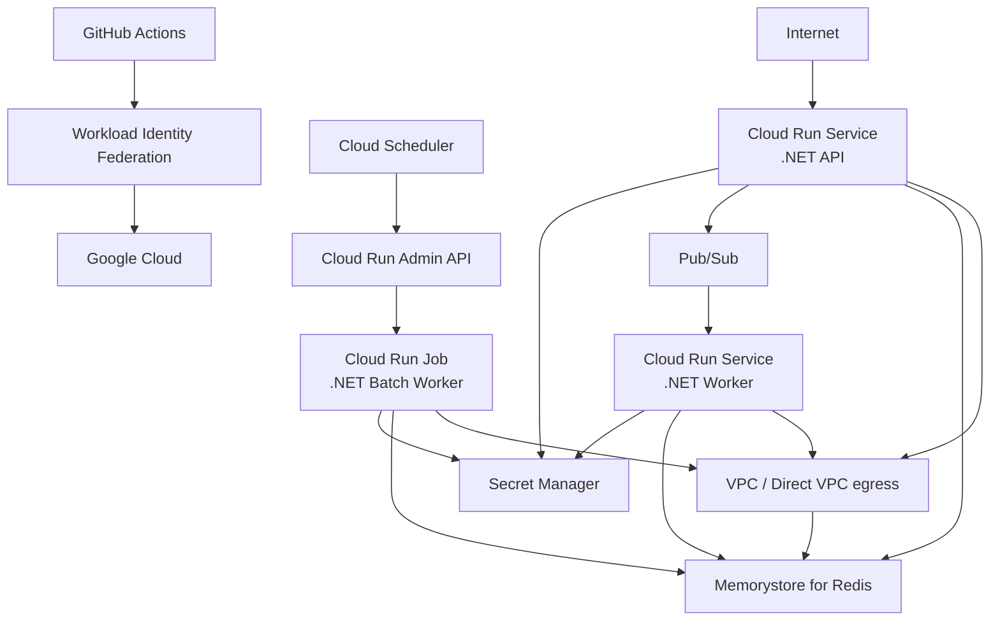

# Terraform GCP .NET Blueprint

Production-oriented Terraform blueprint for running .NET workloads on Google Cloud, with reusable modules, secure defaults, CI/CD, IAM, secrets, messaging, caching, observability, and multi-environment infrastructure patterns.

> **Status:** Infrastructure implementation in progress.

## Goals

This repository demonstrates how to structure production-oriented Infrastructure as Code for .NET workloads on Google Cloud using Terraform.

The project is intentionally focused on infrastructure architecture rather than application complexity. It aims to demonstrate:

- reusable Terraform modules;
- explicit environment composition;
- secure-by-default IAM and secret management;
- Cloud Run services and jobs;
- asynchronous messaging with Pub/Sub;
- private networking and managed caching with Memorystore for Redis;
- observability and operational readiness;
- automated validation and security checks;
- remote state and CI/CD-friendly authentication;
- documented architectural decisions.

## Target architecture



Pub/Sub messages are consumed by a request-serving Cloud Run service. Cloud Run Jobs are modeled separately for finite batch or scheduled workloads and are invoked through supported execution mechanisms such as Cloud Scheduler calling the authenticated Cloud Run Admin API. Pub/Sub is therefore not modeled as directly launching a Cloud Run Job.

Cloud Run workloads that need private services use Direct VPC egress. Memorystore for Redis is attached to the same VPC through Private Service Access rather than a Serverless VPC Access connector.

## Planned repository structure

```text
.
├── .agents/
│   └── skills/
├── .github/
│   ├── dependabot.yml
│   └── workflows/
├── bootstrap/
│   ├── github-actions-wif/
│   └── state/
├── docs/
│   ├── architecture.md
│   ├── agent-skills.md
│   ├── agent-workflow.md
│   ├── memorystore-redis.md
│   ├── networking.md
│   ├── runtime-identities-and-secrets.md
│   └── adr/
├── environments/
│   ├── dev/
│   └── prod/
├── modules/
│   ├── cloud-run-service/
│   ├── cloud-run-job/
│   ├── memorystore-redis/
│   ├── pubsub/
│   ├── runtime-identity/
│   ├── secret-manager/
│   └── vpc-network/
├── examples/
│   ├── cloud-run-service/
│   ├── memorystore-redis/
│   ├── runtime-secrets/
│   └── vpc-network/
├── AGENTS.md
├── .terraform-version
├── .tflint.hcl
└── README.md
```

## Design principles

1. **Secure by default** — no long-lived cloud credentials in the repository or CI/CD pipeline.
2. **Least privilege** — IAM permissions are scoped to the minimum required access.
3. **Reusable modules** — infrastructure capabilities are isolated behind explicit inputs and outputs.
4. **Environment composition** — environments consume modules instead of duplicating resource definitions.
5. **Automated quality gates** — formatting, validation, native Terraform tests, linting and security checks run before changes are merged.
6. **Documented decisions** — relevant trade-offs are captured as Architecture Decision Records.
7. **Production-oriented, not production-prescriptive** — the repository demonstrates patterns that should be adapted to each workload and organization.

## Agent-assisted development

The repository includes project-specific instructions and Agent Skills so Codex can execute issue work consistently across separate chat sessions.

- [`AGENTS.md`](AGENTS.md) is the concise repository instruction map.
- [`docs/agent-workflow.md`](docs/agent-workflow.md) defines the issue, validation, safety, and pull-request workflow.
- [`docs/agent-skills.md`](docs/agent-skills.md) documents the selected skill stack and its sources.
- [`.agents/skills/`](.agents/skills/) contains focused skills for Terraform style, module engineering, testing, GCP security, and GitHub Actions hardening.

Agents must revalidate prerequisite DoD items rather than assuming work from a previous prompt or chat is correct.

## Remote state bootstrap

`bootstrap/state` is an independent Terraform root that creates the Cloud Storage bucket used by later workload roots as their GCS backend.

The bucket is secure by default: object versioning is enabled, uniform bucket-level access is enabled, public access prevention is enforced, `force_destroy` is disabled, and Terraform lifecycle protection prevents accidental destruction.

Bootstrap remains local by design so the repository does not introduce a circular dependency where Terraform needs a remote backend before it can create that backend.

See [`bootstrap/state/README.md`](bootstrap/state/README.md) for prerequisites, initialization, manual apply, backend configuration, migration from local state, recovery guidance, and environment-specific state prefixes.

## GitHub Actions keyless authentication

`bootstrap/github-actions-wif` provisions the Google Cloud trust foundation for keyless GitHub Actions authentication: required APIs, a Workload Identity Pool and GitHub OIDC provider, a dedicated deployment service account, and the service-account impersonation binding.

The trust policy uses immutable GitHub owner and repository IDs and is restricted to `refs/heads/main` by default. The deployment service account receives no project role unless one is explicitly supplied, and broad `roles/owner` / `roles/editor` grants are rejected.

`.github/workflows/gcp-auth-smoke.yml` completes the GitHub side. It is manually triggered from `main`, requests only `contents: read` and `id-token: write`, authenticates with `google-github-actions/auth`, and forces a real access-token exchange through the dedicated service account. No service account key is stored in GitHub.

See [`bootstrap/github-actions-wif/README.md`](bootstrap/github-actions-wif/README.md) for bootstrap instructions, required repository variables, the trust model, smoke-test procedure, and security invariants.

## Cloud Run v2 service module

`modules/cloud-run-service` manages one request-serving `google_cloud_run_v2_service` for .NET APIs or workers and exposes typed inputs for image, CPU, memory, concurrency, scaling, runtime identity, environment variables, Secret Manager references, labels, ingress, deletion protection, and optional Direct VPC egress.

The module requires an explicit runtime service account, defaults to internal-only ingress and provider-level deletion protection, and does not create IAM bindings or secret payloads. Secret-backed environment variables contain only secret identifiers and versions.

Native Terraform tests use a mocked Google provider and plan mode, so module defaults and validation can be exercised in pull requests without Google Cloud credentials or billable resources. See [`modules/cloud-run-service/README.md`](modules/cloud-run-service/README.md) and [`examples/cloud-run-service/`](examples/cloud-run-service/) for the contract and isolated usage example.

## Runtime identities and Secret Manager

`modules/runtime-identity` creates one keyless service account per workload boundary without granting generic project roles. `modules/secret-manager` manages secret metadata and additive `roles/secretmanager.secretAccessor` members at the individual-secret level.

Secret payloads and `google_secret_manager_secret_version` resources are intentionally excluded. A trusted operator or delivery process owns version creation and rotation, while Terraform exposes only `{ secret, version }` references that plug directly into the existing Cloud Run service/job inputs.

See [`docs/runtime-identities-and-secrets.md`](docs/runtime-identities-and-secrets.md) and [`examples/runtime-secrets/`](examples/runtime-secrets/) for identity boundaries, version ownership, and a least-privilege composition example.

## Private networking and Memorystore for Redis

`modules/vpc-network` creates the custom-mode VPC, workload subnet, allocated Private Service Access range, and Service Networking connection. Cloud Run service/job modules can consume its `direct_vpc` output without requiring a Serverless VPC Access connector.

`modules/memorystore-redis` creates a private `google_redis_instance` attached to an explicitly supplied VPC with `PRIVATE_SERVICE_ACCESS`. The production-oriented defaults are `STANDARD_HA`, Redis 7.2, Redis AUTH enabled, TLS server authentication enabled, and deletion prevention enabled.

The generated Redis AUTH string and server CA certificate payloads are deliberately excluded from module outputs. Provider-computed sensitive data may still be persisted in Terraform state, so the protected remote-state strategy remains part of the Redis security boundary.

See [`docs/networking.md`](docs/networking.md), [`docs/memorystore-redis.md`](docs/memorystore-redis.md), [`examples/vpc-network/`](examples/vpc-network/), and [`examples/memorystore-redis/`](examples/memorystore-redis/) for the complete network/cache composition.

## Terraform validation pipeline

Pull requests run independent quality gates for Terraform formatting, root/module validation, native Terraform tests, TFLint, and Trivy IaC security scanning. GitHub Actions are pinned to immutable commit SHAs and monitored by Dependabot for reviewed version updates.

See [`docs/terraform-ci.md`](docs/terraform-ci.md) for discovery rules, testing behavior, security assumptions, dependency-update policy, and local reproduction commands.

## Roadmap

The implementation evolves incrementally:

1. Terraform foundation and repository conventions.
2. Remote state bootstrap on Cloud Storage.
3. Terraform CI, linting and security scanning.
4. GitHub Actions authentication through Workload Identity Federation.
5. Cloud Run v2 service module for .NET APIs and request-serving workers.
6. Pub/Sub worker-service integration plus Cloud Run Job support for scheduled/batch processing.
7. Workload-specific runtime identities and Secret Manager integration.
8. Private VPC networking and Direct VPC egress.
9. Secure Memorystore for Redis integration.
10. Observability, environment composition and production-readiness documentation.

## Current toolchain

- Terraform CLI: pinned through `.terraform-version`.
- Google provider: version constraints are declared by each Terraform root/module as appropriate; current roots target Google provider 8.x and commit dependency lock files.
- Terraform native tests: reusable modules use plan-mode tests and provider mocks where practical.
- TFLint: Terraform recommended rules plus the Google Cloud ruleset.
- Dependabot: weekly GitHub Actions version updates with grouped minor/patch upgrades and isolated major upgrades.
- Google Cloud CLI: pinned in the WIF smoke test for reproducible authentication verification.

## License

Licensed under the MIT License. See [LICENSE](LICENSE).
