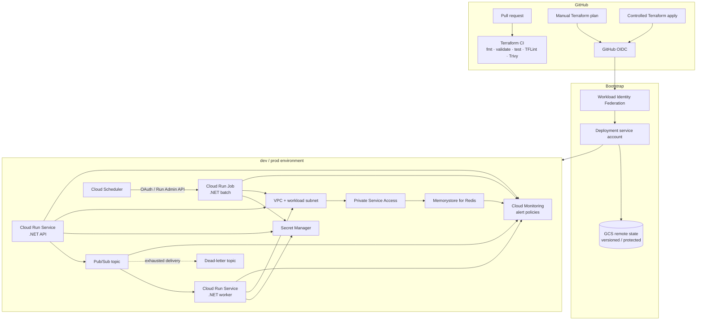

# Terraform GCP .NET Blueprint

**English** | [Português](README.pt-BR.md)

[](https://github.com/rodri-oliveira-dev/terraform-gcp-dotnet-blueprint/actions/workflows/terraform-ci.yml)
[](https://github.com/rodri-oliveira-dev/terraform-gcp-dotnet-blueprint/actions/workflows/deployment-workflow-checks.yml)
[](https://developer.hashicorp.com/terraform)
[](https://cloud.google.com/)
[](https://dotnet.microsoft.com/)
[](https://trivy.dev/)
[](LICENSE)

Production-oriented Terraform reference architecture for running .NET workloads on Google Cloud with secure defaults, reusable modules, isolated `dev`/`prod` roots, keyless delivery, private networking, messaging, caching and operational observability.

> **Status:** Architecture and repository capabilities are complete for the v1.0 baseline. The repository is a reference blueprint, not a universal production configuration. Real-GCP validation evidence is tracked separately in issue #29 and must not be inferred from offline CI alone.

## What this repository demonstrates

The blueprint focuses on infrastructure architecture rather than application complexity. It provides:

- reusable Terraform modules with typed inputs, validation and native tests;
- complete `dev` and `prod` environment composition;
- Cloud Run v2 services for request-serving API/worker workloads;
- Cloud Run Jobs for finite batch execution;
- authenticated Pub/Sub push delivery with retry and dead-letter handling;
- Cloud Scheduler invoking the Cloud Run Admin API for scheduled jobs;
- workload-specific runtime identities and resource-scoped IAM relationships;
- Secret Manager metadata/access without application secret payloads in Terraform;
- custom-mode VPC, Direct VPC egress and Private Service Access;
- Memorystore for Redis with AUTH/TLS and production-oriented HA defaults;
- Cloud Monitoring alert policies plus structured-logging and SLI/SLO guidance;
- protected GCS remote state with environment-specific prefixes;
- GitHub Actions Workload Identity Federation with no service-account keys;
- credential-free PR validation and controlled manual plan/apply workflows;
- Dependabot coverage for GitHub Actions and Terraform dependencies.

## Architecture



The API is not made public by default. Pub/Sub targets a request-serving Cloud Run worker; it does **not** directly execute the Cloud Run Job. Scheduled batch execution uses Cloud Scheduler against the authenticated Cloud Run Admin API.

See [`docs/architecture.md`](docs/architecture.md) for boundaries and design rationale.

## Repository layout

```text
.
├── .agents/                     # repository-specific agent skills
├── .github/
│   ├── scripts/                 # deployment/integration helpers
│   └── workflows/               # CI, WIF smoke, plan and apply workflows
├── bootstrap/
│   ├── state/                   # protected GCS state bucket
│   └── github-actions-wif/      # GitHub OIDC/WIF trust foundation
├── environments/
│   ├── dev/                     # cost-conscious reference environment
│   └── prod/                    # production-oriented reference environment
├── modules/
│   ├── cloud-run-service/
│   ├── cloud-run-job/
│   ├── memorystore-redis/
│   ├── observability-alerts/
│   ├── pubsub/
│   ├── runtime-identity/
│   ├── secret-manager/
│   └── vpc-network/
├── examples/                    # isolated module composition examples
├── docs/                        # architecture and operator documentation
├── AGENTS.md
├── CHANGELOG.md
└── README.md
```

## Secure delivery model

Pull requests never receive GCP credentials. They run formatting, initialization/validation with the backend disabled, Terraform native tests, TFLint and Trivy.

Credentialed operations are explicit and manual:

1. GitHub Actions obtains an OIDC token from `refs/heads/main`.
2. Workload Identity Federation admits only the configured immutable GitHub owner/repository IDs and allowed ref.
3. The dedicated deployment service account is impersonated without a JSON key.
4. `Terraform plan` initializes the selected remote backend and produces only a safe action/address summary.
5. `Terraform apply` requires explicit confirmation, blocks destructive changes by default and uses GitHub Environment protection for the selected environment.
6. The apply job replans after approval and requires the plan fingerprint to match before mutation.

See [`docs/terraform-deployment.md`](docs/terraform-deployment.md) and [`docs/gcp-integration-validation.md`](docs/gcp-integration-validation.md).

## Environment lifecycle

Both roots use a two-phase bootstrap because secret payloads are deliberately outside Terraform:

```text
state bootstrap
    ↓
WIF bootstrap + repository variables
    ↓
environment foundation (enable_workloads = false)
    ↓
external secret-version bootstrap
    ↓
workload activation (enable_workloads = true, one-way per state)
    ↓
observability policies + operational tuning
```

The activation flag is intentionally one-way after it has been applied as `true`; reverting it to `false` is blocked before partial teardown can occur.

See [`docs/environments.md`](docs/environments.md) for the `dev`/`prod` matrix and [`docs/production-readiness.md`](docs/production-readiness.md) for the end-to-end adoption procedure.

## Security boundaries

- No service-account keys in source control or GitHub secrets.
- Public invocation is not granted by the environment roots.
- Runtime identities are separate for API, worker and batch workloads.
- Pub/Sub push and Cloud Scheduler use distinct transport/trigger identities.
- Secret access is granted at individual-secret scope.
- Terraform never manages application secret payload versions.
- Redis AUTH and CA payloads are not exposed as Terraform outputs.
- Direct VPC egress replaces a Serverless VPC Access connector for these workloads.
- Redis uses Private Service Access, AUTH and TLS; production uses `STANDARD_HA` by default.
- Terraform state is treated as sensitive and protected by GCS versioning/access controls.
- Deletion protection is deliberate and must be removed explicitly before destructive lifecycle operations.
- `roles/owner` and `roles/editor` are not acceptable shortcuts for the deployment identity.

## Observability

The environment roots compose `modules/observability-alerts` when workloads are active. The baseline monitors:

- Cloud Run HTTP 5xx ratio;
- Pub/Sub oldest-unacked message age;
- dead-letter forwarding;
- failed Cloud Run Job executions;
- Redis data/system memory pressure;
- rejected Redis connections.

Notification destinations are injected as existing Cloud Monitoring channel resource names and remain outside this state. Application logging/tracing semantics remain an application responsibility.

See [`docs/observability.md`](docs/observability.md).

## Production readiness

The repository contains a consolidated operator guide covering:

- zero-to-environment bootstrap order;
- deployment and secret-bootstrap boundaries;
- `dev` versus `prod` policy differences;
- state recovery and deletion protection;
- troubleshooting by failure domain;
- known limitations and deliberate non-goals;
- an adoption checklist;
- a `v1.0.0` release-readiness checklist.

Start with [`docs/production-readiness.md`](docs/production-readiness.md) and [`docs/troubleshooting.md`](docs/troubleshooting.md).

## Validation status and limits

Offline PR CI proves Terraform syntax/contracts, module tests, linting and static IaC security checks. A manual WIF-authenticated plan from `main` is the separate real-GCP validation layer. Issue #29 tracks the run evidence required before claiming successful backend/provider/API validation against a real development project.

A successful plan is **not** proof that workloads start correctly, Pub/Sub delivers successfully, Redis clients authenticate, alert notifications fire, or production capacity is sufficient. Those concerns require workload-specific deployment/verification outside the generic blueprint baseline.

## Current toolchain

- Terraform CLI pinned through `.terraform-version` (1.16.x baseline).
- Google provider constrained to 8.x by current executable roots/modules; lock files pin selected provider builds.
- Terraform native tests use plan mode and mocked providers where practical.
- TFLint uses Terraform recommended rules plus the Google ruleset.
- Trivy blocks HIGH/CRITICAL IaC findings in repository CI.
- GitHub Actions are pinned to immutable commit SHAs.
- Dependabot checks GitHub Actions and Terraform dependencies weekly; majors remain separately reviewable.

## Release

The first stable baseline is prepared as `v1.0.0`, but this repository does not create a tag or GitHub Release automatically. Review [`CHANGELOG.md`](CHANGELOG.md), [`docs/releases/v1.0.0.md`](docs/releases/v1.0.0.md), the release-readiness checklist, current CI, and issue #29 evidence before publishing.

## License

Licensed under the MIT License. See [LICENSE](LICENSE).
