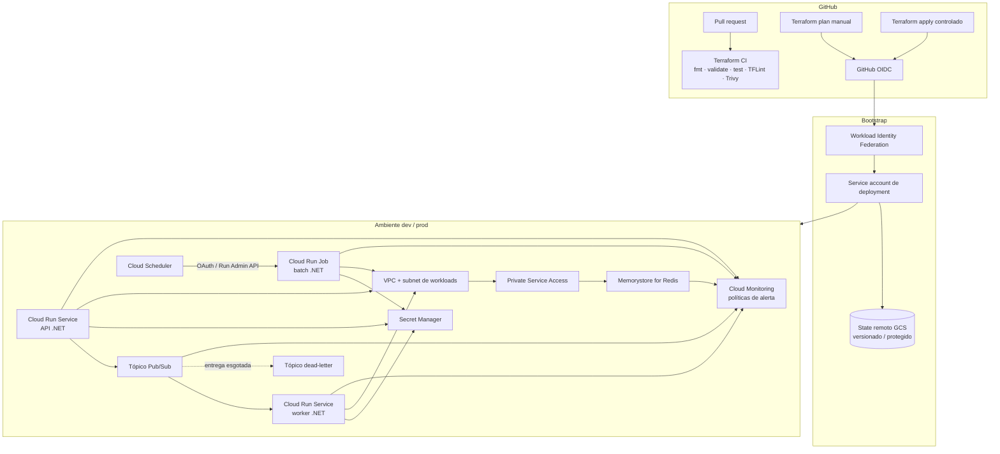

# Terraform GCP .NET Blueprint

[English](README.md) | **Português**

[](https://github.com/rodri-oliveira-dev/terraform-gcp-dotnet-blueprint/actions/workflows/terraform-ci.yml)
[](https://github.com/rodri-oliveira-dev/terraform-gcp-dotnet-blueprint/actions/workflows/deployment-workflow-checks.yml)
[](https://developer.hashicorp.com/terraform)
[](https://cloud.google.com/)
[](https://dotnet.microsoft.com/)
[](https://trivy.dev/)
[](LICENSE)

Arquitetura de referência Terraform orientada a produção para executar workloads .NET no Google Cloud, com padrões seguros, módulos reutilizáveis, roots `dev`/`prod` isolados, entrega sem chaves, rede privada, mensageria, cache e observabilidade operacional.

> **Status:** A arquitetura e as capacidades do repositório estão completas para o baseline v1.0. O repositório é um blueprint de referência, não uma configuração universal de produção. As evidências de validação em GCP real são acompanhadas separadamente na issue #29 e não devem ser inferidas apenas a partir do CI offline.

## O que este repositório demonstra

O blueprint prioriza a arquitetura de infraestrutura em vez da complexidade da aplicação. Ele oferece:

- módulos Terraform reutilizáveis com entradas tipadas, validações e testes nativos;
- composição completa dos ambientes `dev` e `prod`;
- serviços Cloud Run v2 para workloads de API/worker orientados a requisições;
- Cloud Run Jobs para execução de batch finito;
- entrega push autenticada do Pub/Sub com retries e tratamento de dead-letter;
- Cloud Scheduler invocando a Cloud Run Admin API para jobs agendados;
- identidades de runtime específicas por workload e relações IAM com escopo de recurso;
- metadados/acessos do Secret Manager sem payloads de segredos da aplicação no Terraform;
- VPC em modo customizado, Direct VPC egress e Private Service Access;
- Memorystore for Redis com AUTH/TLS e padrões de alta disponibilidade orientados a produção;
- políticas de alerta do Cloud Monitoring, além de orientações para logs estruturados e SLI/SLO;
- state remoto em GCS protegido, com prefixos específicos por ambiente;
- Workload Identity Federation no GitHub Actions, sem chaves de service account;
- validação de PR sem credenciais e workflows manuais controlados de plan/apply;
- cobertura do Dependabot para GitHub Actions e dependências Terraform.

## Arquitetura



A API não é tornada pública por padrão. O Pub/Sub direciona mensagens a um worker Cloud Run orientado a requisições; ele **não** executa diretamente o Cloud Run Job. A execução de batch agendada usa o Cloud Scheduler contra a Cloud Run Admin API autenticada.

Consulte [`docs/architecture.pt-BR.md`](docs/architecture.pt-BR.md) para os limites e a justificativa das decisões de design.

## Estrutura do repositório

```text
.
├── .agents/                     # skills específicas do repositório
├── .github/
│   ├── scripts/                 # helpers de deployment/integração
│   └── workflows/               # CI, smoke de WIF, plan e apply
├── bootstrap/
│   ├── state/                   # bucket GCS protegido para state
│   └── github-actions-wif/      # fundação de confiança GitHub OIDC/WIF
├── environments/
│   ├── dev/                     # ambiente de referência com foco em custo
│   └── prod/                    # ambiente de referência orientado a produção
├── modules/
│   ├── cloud-run-service/
│   ├── cloud-run-job/
│   ├── memorystore-redis/
│   ├── observability-alerts/
│   ├── pubsub/
│   ├── runtime-identity/
│   ├── secret-manager/
│   └── vpc-network/
├── examples/                    # exemplos isolados de composição dos módulos
├── docs/                        # documentação de arquitetura e operação
├── AGENTS.md
├── CHANGELOG.md
└── README.md
```

## Modelo seguro de entrega

Pull requests nunca recebem credenciais do GCP. Eles executam formatação, inicialização/validação com backend desabilitado, testes nativos do Terraform, TFLint e Trivy.

As operações autenticadas são explícitas e manuais:

1. O GitHub Actions obtém um token OIDC a partir de `refs/heads/main`.
2. O Workload Identity Federation admite apenas os IDs imutáveis configurados do owner/repositório GitHub e a ref permitida.
3. A service account dedicada de deployment é impersonada sem chave JSON.
4. O `Terraform plan` inicializa o backend remoto selecionado e produz apenas um resumo seguro de ações/endereços.
5. O `Terraform apply` exige confirmação explícita, bloqueia mudanças destrutivas por padrão e usa a proteção de GitHub Environment para o ambiente selecionado.
6. O job de apply refaz o plan após a aprovação e exige que o fingerprint do plano permaneça idêntico antes de qualquer mutação.

Consulte [`docs/terraform-deployment.pt-BR.md`](docs/terraform-deployment.pt-BR.md) e [`docs/gcp-integration-validation.pt-BR.md`](docs/gcp-integration-validation.pt-BR.md).

## Ciclo de vida dos ambientes

Os dois roots usam bootstrap em duas fases porque os payloads de segredos ficam deliberadamente fora do Terraform:

```text
bootstrap do state
    ↓
bootstrap do WIF + variáveis do repositório
    ↓
fundação do ambiente (enable_workloads = false)
    ↓
bootstrap externo das versões dos segredos
    ↓
ativação dos workloads (enable_workloads = true, transição unidirecional por state)
    ↓
políticas de observabilidade + ajustes operacionais
```

A flag de ativação é deliberadamente unidirecional depois de aplicada como `true`; revertê-la para `false` é bloqueado antes que uma remoção parcial possa ocorrer.

Consulte [`docs/environments.pt-BR.md`](docs/environments.pt-BR.md) para a matriz `dev`/`prod` e [`docs/production-readiness.pt-BR.md`](docs/production-readiness.pt-BR.md) para o procedimento completo de adoção.

## Limites de segurança

- Nenhuma chave de service account em controle de versão ou GitHub Secrets.
- Invocação pública não é concedida pelos roots dos ambientes.
- As identidades de runtime são separadas para API, worker e workloads de batch.
- Pub/Sub push e Cloud Scheduler usam identidades distintas de transporte/disparo.
- O acesso a segredos é concedido no escopo de cada segredo individual.
- O Terraform nunca gerencia versões de payloads dos segredos da aplicação.
- Payloads de Redis AUTH e CA não são expostos como outputs Terraform.
- Direct VPC egress substitui um Serverless VPC Access connector para estes workloads.
- O Redis usa Private Service Access, AUTH e TLS; produção usa `STANDARD_HA` por padrão.
- O state Terraform é tratado como sensível e protegido por versionamento e controles de acesso do GCS.
- A proteção contra exclusão é intencional e deve ser removida explicitamente antes de operações destrutivas de ciclo de vida.
- `roles/owner` e `roles/editor` não são atalhos aceitáveis para a identidade de deployment.

## Observabilidade

Os roots dos ambientes compõem `modules/observability-alerts` quando os workloads estão ativos. O baseline monitora:

- taxa HTTP 5xx do Cloud Run;
- idade da mensagem não confirmada mais antiga no Pub/Sub;
- encaminhamento para dead-letter;
- execuções com falha de Cloud Run Jobs;
- pressão de memória de dados/sistema no Redis;
- conexões rejeitadas pelo Redis.

Os destinos de notificação são injetados como nomes de recursos de canais existentes do Cloud Monitoring e permanecem fora deste state. A semântica de logging/tracing da aplicação continua sendo responsabilidade da aplicação.

Consulte [`docs/observability.pt-BR.md`](docs/observability.pt-BR.md).

## Prontidão para produção

O repositório contém um guia consolidado para operadores cobrindo:

- ordem de bootstrap do zero até o ambiente;
- limites entre deployment e bootstrap de segredos;
- diferenças de política entre `dev` e `prod`;
- recuperação de state e proteção contra exclusão;
- troubleshooting por domínio de falha;
- limitações conhecidas e não objetivos deliberados;
- checklist de adoção;
- checklist de prontidão da release `v1.0.0`.

Comece por [`docs/production-readiness.pt-BR.md`](docs/production-readiness.pt-BR.md) e [`docs/troubleshooting.pt-BR.md`](docs/troubleshooting.pt-BR.md).

## Status e limites da validação

O CI offline de PR comprova sintaxe/contratos Terraform, testes dos módulos, linting e verificações estáticas de segurança IaC. Um plan manual autenticado via WIF a partir da `main` é a camada separada de validação em GCP real. A issue #29 acompanha a evidência do run necessária antes de afirmar que backend/provider/APIs foram validados com sucesso em um projeto real de desenvolvimento.

Um plan bem-sucedido **não** comprova que os workloads iniciam corretamente, que o Pub/Sub entrega mensagens com sucesso, que clientes Redis autenticam, que notificações de alertas disparam ou que a capacidade de produção é suficiente. Essas preocupações exigem deployment/verificação específicos do workload, fora do baseline genérico do blueprint.

## Toolchain atual

- Terraform CLI fixado por `.terraform-version` (baseline 1.16.x).
- Provider Google restrito a 8.x pelos roots/módulos executáveis atuais; lock files fixam os builds selecionados do provider.
- Testes nativos do Terraform usam modo plan e providers mockados quando prático.
- TFLint usa as regras recomendadas do Terraform mais o ruleset Google.
- Trivy bloqueia achados IaC HIGH/CRITICAL no CI do repositório.
- GitHub Actions estão fixadas por SHAs imutáveis de commit.
- Dependabot verifica semanalmente GitHub Actions e dependências Terraform; majors permanecem isoladas para revisão.

## Release

O primeiro baseline estável está preparado como `v1.0.0`, mas este repositório não cria tag nem GitHub Release automaticamente. Revise [`CHANGELOG.pt-BR.md`](CHANGELOG.pt-BR.md), [`docs/releases/v1.0.0.pt-BR.md`](docs/releases/v1.0.0.pt-BR.md), o checklist de prontidão da release, o CI atual e as evidências da issue #29 antes de publicar.

## Licença

Licenciado sob a licença MIT. Consulte [LICENSE](LICENSE).
