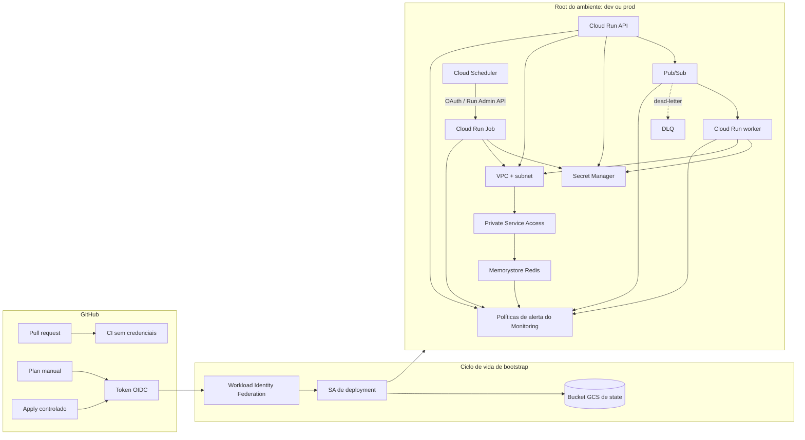

# Visão geral da arquitetura

## Propósito

Este repositório é uma arquitetura de referência Terraform orientada a produção para workloads .NET no Google Cloud. Ele separa responsabilidades de bootstrap, capacidades reutilizáveis de infraestrutura, políticas de ambiente, controles de entrega e orientação operacional para que cada camada possa evoluir sem colapsar em um único state monolítico.

O blueprint é intencionalmente opinativo sobre limites e padrões seguros, mas não é um template universal de produção. Capacidade, SLOs, desenho de edge público, políticas organizacionais e controles específicos de negócio permanecem decisões de cada workload.

## Arquitetura final



A principal regra de design é manter os control planes explícitos: o Pub/Sub entrega requisições a um Cloud Run **service**, enquanto trabalho batch finito é executado por um Cloud Run **job** iniciado por meio da Run Admin API. Os roots dos ambientes não tornam a API pública por padrão.

## Camadas arquiteturais

### Bootstrap

`bootstrap/state` é responsável pelo bucket protegido do Cloud Storage usado pelos demais states Terraform. Ele começa intencionalmente com state local porque um backend não pode depender de si mesmo.

`bootstrap/github-actions-wif` é responsável pelo limite de confiança GitHub OIDC e pela identidade dedicada de deployment. A confiança padrão restringe a admissão usando os IDs imutáveis do owner/repositório GitHub, além de `refs/heads/main`.

O bootstrap possui ciclo de vida diferente dos ambientes de aplicação e deve permanecer pequeno, revisado e raramente alterado.

### Módulos reutilizáveis

`modules/` contém capacidades focadas, e não ambientes completos:

- `cloud-run-service` — um serviço Cloud Run v2 orientado a requisições;
- `cloud-run-job` — um Cloud Run v2 Job finito;
- `pubsub` — tópico/subscription, retry, DLQ e relações de push autenticado;
- `runtime-identity` — service account de workload sem chaves;
- `secret-manager` — metadados de segredo e relações de acesso com escopo restrito;
- `vpc-network` — VPC customizada, subnet e fundação de Private Service Access;
- `memorystore-redis` — instância Redis privada com padrões AUTH/TLS;
- `observability-alerts` — baseline de políticas de alerta do Cloud Monitoring.

Módulos filhos não são responsáveis por backends, credenciais de provider, constantes de ambiente ou payloads de segredos da aplicação.

### Roots de ambiente

`environments/dev` e `environments/prod` compõem as mesmas capacidades e são responsáveis pelas diferenças de política, como CIDRs, tier/capacidade do Redis, sizing de compute, scaling, thresholds de retry e thresholds de observabilidade.

Cada root possui seu próprio prefixo fixo no GCS (`environments/dev` ou `environments/prod`). Ambos usam o mesmo modelo de bootstrap de segredos em duas fases e ativação unidirecional de workloads.

### Entrega

O CI de pull requests permanece sem credenciais. Ele executa formatação Terraform, inicialização/validação com backend desabilitado, testes nativos, TFLint e Trivy.

Operações autenticadas são manuais e restritas à `main`:

```text
GitHub workflow_dispatch
        |
        v
Token GitHub OIDC
        |
        v
Workload Identity Federation
        |
        v
Service account dedicada de deployment
        |
        +--> backend GCS
        `--> ambiente GCP selecionado
```

O workflow de plan nunca envia o plan binário ou o JSON completo como artifact. O workflow de apply exige confirmação explícita, bloqueia mudanças destrutivas por padrão, usa proteção de GitHub Environment, refaz o plan após aprovação e compara um fingerprint antes de aplicar o novo saved plan.

Consulte `docs/terraform-deployment.md`.

## Limite entre identidade de runtime e segredos

API, worker e batch usam service accounts de runtime diferentes. Pub/Sub push e Cloud Scheduler usam identidades de transporte/disparo diferentes dos workloads que invocam.

`modules/secret-manager` concede `roles/secretmanager.secretAccessor` apenas às identidades explicitamente listadas, no escopo de cada segredo. O Terraform cria containers de segredos e IAM, mas não cria versões dos segredos da aplicação.

O ciclo de vida do ambiente, portanto, possui duas fases:

```text
Apply da fundação
  ├─ rede / PSA / Redis
  ├─ identidades
  ├─ containers de segredos + IAM
  └─ APIs necessárias
        |
        v
Bootstrap externo e confiável das versões dos segredos
        |
        v
Ativação dos workloads
  ├─ API
  ├─ worker + Pub/Sub
  ├─ job + Scheduler
  └─ políticas de alerta do Monitoring
```

Redis AUTH e material de CA do servidor seguem a mesma regra: a transferência desses payloads é uma responsabilidade do operador/aplicação e eles não são expostos como outputs Terraform.

## Limite de rede

`modules/vpc-network` é responsável por uma VPC em modo customizado, uma subnet regional de workloads, um range PSA alocado e a conexão com Service Networking. Serviços/jobs Cloud Run usam Direct VPC egress; o blueprint não cria Serverless VPC Access connector.

```text
Cloud Run service/job
        |
        | Direct VPC egress
        v
subnet de workloads / VPC
        |
        v
Private Service Access
        |
        v
Memorystore for Redis
```

CIDRs da subnet e ranges PSA são alocações separadas e precisam ser revisados em relação aos planos de roteamento/endereçamento da organização antes da adoção.

## Limite do Redis

`modules/memorystore-redis` fixa o modelo de conectividade em `PRIVATE_SERVICE_ACCESS`, habilita AUTH e TLS por padrão e usa prevenção de exclusão no provider. `prod` compõe `STANDARD_HA`; `dev` usa intencionalmente `BASIC` para demonstrar uma política de ambiente orientada a custo sem enfraquecer AUTH/TLS.

O state continua sensível porque valores calculados pelo provider podem persistir mesmo quando nenhum output os expõe. O acesso ao backend, portanto, faz parte do modelo de segurança do Redis.

## Limite de observabilidade

`modules/observability-alerts` é responsável apenas pelas políticas de alerta de plataforma. Os roots de ambiente fornecem nomes reais de recursos, thresholds e nomes de recursos de canais de notificação existentes.

O baseline cobre taxa de 5xx do Cloud Run, backlog antigo/encaminhamento para DLQ no Pub/Sub, execuções com falha de Cloud Run Jobs e pressão/conexões rejeitadas no Redis.

O código da aplicação é responsável por logs semânticos, traces, métricas customizadas e redaction. Destinos/segredos de notificação são responsabilidades da organização fora deste state Terraform. O blueprint não inventa metas de SLO.

Consulte `docs/observability.md`.

## Limite de state e recovery

O bucket GCS de state usa versionamento, uniform bucket-level access, prevenção de acesso público, `force_destroy = false` e `prevent_destroy` do Terraform. States de ambiente usam prefixos isolados.

Recovery é um procedimento do operador, não uma funcionalidade de CI. Restauração de state, `force-unlock`, remoção/import de state e mudanças em proteções de lifecycle devem ser deliberadas e revisadas. Consulte `bootstrap/state/README.md` e `docs/production-readiness.md`.

## Limite de validação

Existem intencionalmente dois níveis de evidência:

1. **Validação offline/de contrato** — CI de PR e testes Terraform com mocks; sem credenciais GCP.
2. **Validação de plan em GCP real** — plan manual autenticado via WIF a partir da `main`, backend GCS real e refresh de provider/API contra `dev`.

Nenhum dos dois comprova comportamento em runtime. A issue #29 registra a evidência necessária antes de afirmar que o segundo nível foi executado com sucesso. Criar/exercitar recursos com custo é uma atividade separada e explicitamente autorizada.

## Não objetivos deliberados

O baseline v1.0 intencionalmente não fornece:

- edge público para API/load balancer/API Gateway;
- DNS customizado ou certificados gerenciados;
- Cloud SQL ou outro banco relacional;
- GKE/Kubernetes;
- Cloud NAT ou arquitetura genérica de saída para internet;
- políticas de organização/folder;
- builds de containers da aplicação ou código de negócio;
- criação/rotação de payloads de segredos;
- metas universais de SLO ou dashboards customizados genéricos;
- recovery destrutivo automático, manipulação de state ou workflows de `terraform destroy`;
- afirmação de que o sizing de referência é adequado a qualquer workload de produção.

Estes são pontos de extensão, não dependências ocultas ausentes.

## Princípios de segurança

- autenticação GitHub-to-GCP sem chaves;
- privilégio mínimo e relações IAM explícitas;
- identidades separadas de runtime e transporte;
- nenhum payload de segredo da aplicação em source/variáveis Terraform;
- conectividade privada do Redis, AUTH e TLS;
- nenhuma invocação pública por padrão;
- state remoto sensível com prefixos isolados e histórico de recovery;
- validação de pull requests sem credenciais;
- pins imutáveis de actions com manutenção via Dependabot;
- aprovação explícita e confirmação de mudança destrutiva antes do apply.

Para sequência de adoção, riscos operacionais e critérios de prontidão da release, consulte `docs/production-readiness.md`.
