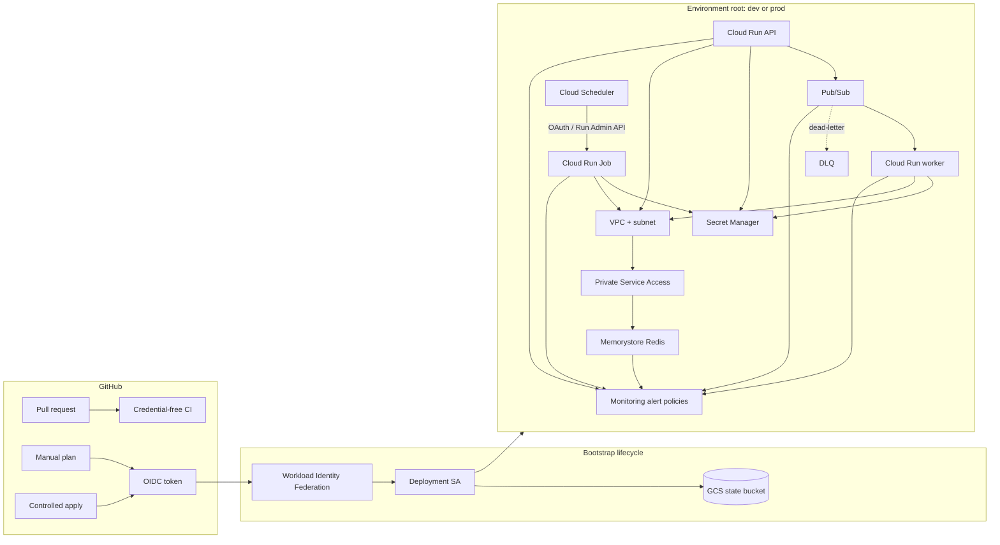

# Architecture Overview

## Purpose

This repository is a production-oriented Terraform reference architecture for .NET workloads on Google Cloud. It separates bootstrap concerns, reusable infrastructure capabilities, environment policy, delivery controls and operational guidance so each layer can evolve without collapsing into one monolithic state.

The blueprint is intentionally opinionated about boundaries and secure defaults, but it is not a universal production template. Capacity, SLOs, public-edge design, organization policy and business-specific controls remain workload decisions.

## Final architecture



The major design rule is that control planes stay explicit: Pub/Sub delivers requests to a Cloud Run **service**, while finite batch work is a Cloud Run **job** started through the Run Admin API. The environment roots do not make the API public by default.

## Architectural layers

### Bootstrap

`bootstrap/state` owns the protected Cloud Storage bucket used by later Terraform states. It intentionally begins with local state because a backend cannot depend on itself.

`bootstrap/github-actions-wif` owns the GitHub OIDC trust boundary and dedicated deployment identity. The default trust restricts admission using immutable GitHub owner/repository IDs plus `refs/heads/main`.

Bootstrap has a different lifecycle from application environments and should remain small, reviewed and rarely changed.

### Reusable modules

`modules/` contains focused capabilities rather than complete environments:

- `cloud-run-service` — one request-serving Cloud Run v2 service;
- `cloud-run-job` — one finite Cloud Run v2 job;
- `pubsub` — topic/subscription, retry, DLQ and authenticated push relationships;
- `runtime-identity` — keyless workload service account;
- `secret-manager` — secret metadata plus scoped accessor relationships;
- `vpc-network` — custom VPC, subnet and Private Service Access foundation;
- `memorystore-redis` — private Redis instance with AUTH/TLS defaults;
- `observability-alerts` — Cloud Monitoring alert-policy baseline.

Child modules do not own backends, provider credentials, environment constants or application secret payloads.

### Environment roots

`environments/dev` and `environments/prod` compose the same capabilities and own policy differences such as CIDRs, Redis tier/capacity, compute sizing, scaling, retry thresholds and observability thresholds.

Each root has its own fixed GCS prefix (`environments/dev` or `environments/prod`). Both use the same two-phase secret bootstrap and one-way workload activation model.

### Delivery

Pull-request CI remains credential-free. It runs Terraform formatting, backend-disabled initialization/validation, native tests, TFLint and Trivy.

Credentialed operations are manual and restricted to `main`:

```text
GitHub workflow_dispatch
        |
        v
GitHub OIDC token
        |
        v
Workload Identity Federation
        |
        v
Dedicated deployment service account
        |
        +--> GCS backend
        `--> selected GCP environment
```

The plan workflow never uploads the binary plan/full JSON. The apply workflow requires explicit confirmation, blocks destructive changes by default, uses GitHub Environment protection, replans after approval and compares a fingerprint before applying the fresh saved plan.

See `docs/terraform-deployment.md`.

## Runtime identity and secrets boundary

API, worker and batch use different runtime service accounts. Pub/Sub push and Cloud Scheduler use different transport/trigger identities from the workloads they invoke.

`modules/secret-manager` grants `roles/secretmanager.secretAccessor` only to explicitly listed identities at individual-secret scope. Terraform creates secret containers and IAM but does not create application secret versions.

The environment lifecycle therefore has two phases:

```text
Foundation apply
  ├─ network / PSA / Redis
  ├─ identities
  ├─ secret containers + IAM
  └─ required APIs
        |
        v
External trusted secret-version bootstrap
        |
        v
Workload activation
  ├─ API
  ├─ worker + Pub/Sub
  ├─ job + Scheduler
  └─ Monitoring alert policies
```

Redis AUTH and server CA material follow the same rule: payload transfer is an operator/application concern and is not surfaced as Terraform outputs.

## Networking boundary

`modules/vpc-network` owns one custom-mode VPC, one regional workload subnet, one allocated PSA range and the Service Networking connection. Cloud Run services/jobs use Direct VPC egress; the blueprint does not create a Serverless VPC Access connector.

```text
Cloud Run service/job
        |
        | Direct VPC egress
        v
workload subnet / VPC
        |
        v
Private Service Access
        |
        v
Memorystore for Redis
```

Subnet CIDRs and PSA ranges are separate allocations and must be reviewed against organization routing/address plans before adoption.

## Redis boundary

`modules/memorystore-redis` fixes the connectivity model to `PRIVATE_SERVICE_ACCESS`, enables AUTH and TLS by default, and uses provider-level deletion prevention. `prod` composes `STANDARD_HA`; `dev` intentionally uses `BASIC` to demonstrate a cost-oriented environment policy without weakening AUTH/TLS.

State remains sensitive because provider-computed values can persist even when no output exposes them. Backend access is therefore part of the Redis security model.

## Observability boundary

`modules/observability-alerts` owns platform alert policies only. Environment roots supply actual resource names, thresholds and existing notification channel resource names.

The baseline covers Cloud Run 5xx ratio, Pub/Sub stale backlog/DLQ forwarding, failed Cloud Run Job executions and Redis pressure/rejected connections.

Application code owns semantic logs, traces, custom metrics and redaction. Notification destinations/secrets are organization-owned concerns outside this Terraform state. SLO targets are not invented by the blueprint.

See `docs/observability.md`.

## State and recovery boundary

The GCS state bucket uses versioning, uniform bucket-level access, public access prevention, `force_destroy = false` and Terraform `prevent_destroy`. Environment states use isolated prefixes.

Recovery is an operator procedure, not a CI feature. State restoration, `force-unlock`, state removal/import and lifecycle-protection changes must be deliberate and reviewed. See `bootstrap/state/README.md` and `docs/production-readiness.md`.

## Validation boundary

There are intentionally two evidence levels:

1. **Offline/contract validation** — PR CI and mocked Terraform tests; no GCP credentials.
2. **Real-GCP plan validation** — manual WIF-authenticated plan from `main`, real GCS backend and provider/API refresh against `dev`.

Neither proves runtime behavior. Issue #29 records the evidence required before claiming the second level has successfully executed. Creating/exercising billable resources is a separate explicitly authorized activity.

## Deliberate non-goals

The v1.0 baseline intentionally does not provide:

- public API edge/load balancer/API Gateway configuration;
- custom DNS or managed certificates;
- Cloud SQL or another relational database;
- GKE/Kubernetes;
- Cloud NAT or generic outbound-internet architecture;
- organization/folder policies;
- application container builds or business application code;
- secret payload creation/rotation;
- universal SLO targets or generic custom dashboards;
- automatic destructive recovery, state surgery or `terraform destroy` workflows;
- a claim that the reference sizing is appropriate for an arbitrary production workload.

These are extension points, not missing hidden dependencies.

## Security principles

- keyless GitHub-to-GCP authentication;
- least privilege and explicit IAM relationships;
- separate runtime and transport identities;
- no application secret payloads in Terraform source/variables;
- private Redis connectivity, AUTH and TLS;
- no public invocation by default;
- sensitive remote state with isolated prefixes and recovery history;
- credential-free pull-request validation;
- immutable action pins plus Dependabot maintenance;
- explicit approval and destructive-change acknowledgement before apply.

For adoption sequencing, operational risks and release-readiness criteria, see `docs/production-readiness.md`.
